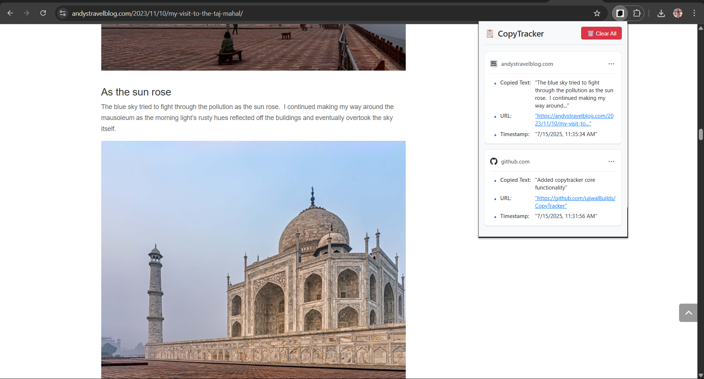

# 📋 CopyTracker

> A lightweight Chrome Extension to keep track of everything you copy — including the source URL and timestamp.

---

## ✨ Features

- 🔍 Automatically tracks copied text from any tab
- 🌐 Logs the page URL where the copy happened
- 🕒 Stores timestamp for each entry
- 🧠 Simple popup UI to view and re-copy past entries
- 🔒 Stored securely in local storage (no external servers)
- ⏳ Keeps the most recent 100 copied entries

---

## 📷 Screenshot

---

## ⚙️ How to Use

1. Clone or download this repo
2. Open **Chrome** and navigate to `chrome://extensions`
3. Enable **Developer Mode** (top right)
4. Click **Load unpacked**
5. Select the project folder
6. Open any website, select and copy some text (Ctrl/Cmd+C)
7. Click the CopyTracker icon in the toolbar to view your clipboard history

---
